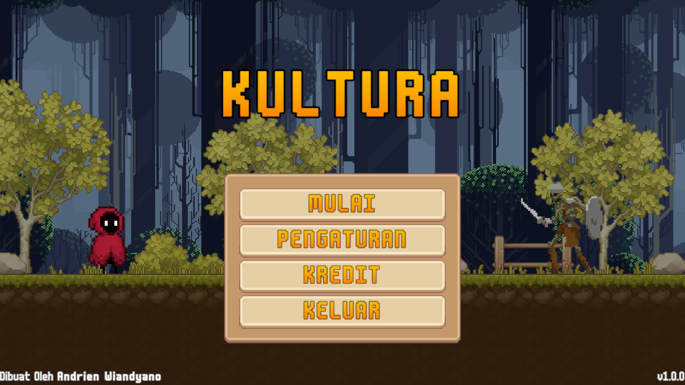

# Proses Instalasi Game Kultura (Android)

**1. Unduh versi terbaru melalui tautan berikut ini: [Unduh Game](https://github.com/ArnNied/kultura/releases/latest/download/kultura.apk)**

**2a. Buka/jalankan .apk tersebut melalui rak notifikasi, ATAU**

**2b. Temukan file .apk tersebut melalui file manager masing masing perangkat, lalu buka/jalankan**

CATATAN: Tergantung perangkat smartphone anda, akan ada beberapa konfirmasi lagi untuk menginstall aplikasi yang bukan didapatkan dari playstore.

Untuk info lebih lanjut bisa cari di internet **"Cara install apk untuk perangkat NAMA_PERANGKAT"**.

Contoh: "Cara install apk untuk Poco X5 Pro"

**3. Tunggu hingga selesai**

**4. Jalankan aplikasi**

**5. Selamat Bermain!**

